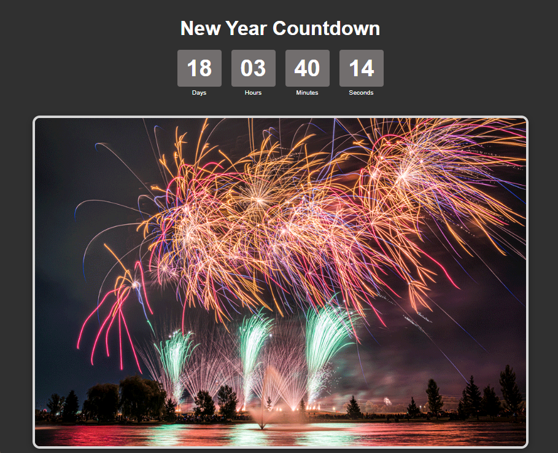

# Countdown Timer App

This project is an Angular application that provides a countdown timer to a specified deadline (New Years Day 2025). It retrieves the deadline from a backend service built with Express and updates the countdown every second.


## Features

- Displays the time remaining until the specified deadline.
- Updates in real-time every second.
- Responsive design suitable for various devices.
- Simple and intuitive user interface.

## Technologies Used

- **Angular**: Frontend framework for building dynamic web applications.
- **RxJS**: Library for reactive programming using Observables.
- **Express**: Backend framework for building web applications.
- **HTML5** and **CSS3**: For structuring and styling the application.

## Getting Started

### Prerequisites

Make sure you have the following installed:

- [Node.js](https://nodejs.org/) (version 12 or later)
- [Angular CLI](https://angular.io/cli) (install globally with `npm install -g @angular/cli`)

### Setting Up the Angular Frontend

1. **Clone the repository**:
   ```bash
   git clone https://github.com/yourusername/countdown-timer.git
   cd countdown-timer
2. **Install the dependencies:**:
   ```bash
   cd frontend
   npm install
3. **Start the development server:**:
   ```bash
   ng serve
4. **Open your browser and navigate to http://localhost:4200/. The application will automatically reload whenever you modify any of the source files.**:

### Setting Up the Express Backend

1. **Navigate to the backend directory**:
   ```bash
   cd ../backend
2. **Initialize a new Node.js project (if not already done)**:
   ```bash
   npm init -y
3. **Install Express and CORS:**:
   ```bash
   npm install express cors
4. **Start your Express server:**:
   ```bash
   node server.js
5. **Your Express server should now be running on http://localhost:3000, providing countdown data to your Angular frontend.**